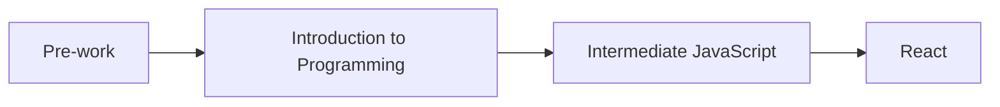

Hi! Welcome to Fidgetech's Coding Program. Throughout the course of each coding module, you'll experience a step-by-step guide that will take you from zero experience to web programmer in a short time. This program contains both lessons and practice exercises. This content is the curriculum for [Fidgetech](https://fidgetech.org/), a school for virtual training in technology and design with practical AI skills to prepare students for meaningful employment. You'll learn more about responsible AI use in [Using AI Responsibly at Fidgetech](./1-0-0-13-using-ai-responsibly-at-fidgetech).

## [Our Philosophy](#our-philosophy)

---

Before we get started, let's discuss our general philosophy at Fidgetech. If you talk to an experienced developer, they'll likely agree that the more you learn about programming, the more you realize just how little you know. It's like pointing a telescope out at the universe... there are more stars, galaxies, and solar systems the further you go. The same is true with coding: **you won't learn everything at once, and that's normal.** There is always more to explore.

Being a developer is not about learning a fixed set of skills that you can apply for the rest of your career. A tool you learn today may be replaced by a tool you learn a few years from now. Even if it's not replaced, it will likely be updated and modified, perhaps to the point where it no longer looks like the tool you use today.

That understanding fundamentally shapes how we structure Fidgetech. **We believe that the languages, tools, and approaches you'll learn here are much less important than the general skills of solving problems**. Successful programmers embrace the limitations of their knowledge and get good at figuring out what they don't know. They develop a mindset in which _not knowing_ the answer isn't a source of anxiety, but rather an opportunity to learn and explore.

## [How Fidgetech's Coding Program Works](#how-fidgetechcodingprogram-com-works)

---

Now let's explore how this site works.

Fidgetech offers one program track: **Web Development**. You move through courses in order. Each course builds on the last.

**Your path through the program**

1. **Pre-work** (you are here): Fidgetech culture, tools, and remote learning setup.
2. **Introduction to Programming**: Build basic web pages with HTML and CSS, add interactivity with JavaScript, and learn Git and the command line.
3. **Intermediate JavaScript**: Go deeper with JavaScript and more advanced tools.
4. **React**: Build dynamic user interfaces with React and TypeScript.

**A few terms that help**

- **HTML** and **CSS** structure and style web pages. Browsers understand them, but they are not full programming languages.
- **JavaScript** is the programming language browsers run. You need it for interactivity on the web—whether you lean toward front-end (what users see) or back-end (servers and data).
- **React** is a tool (or framework) that you will learn later. It brings everything you've learned together into a powerful way to build interactive, dynamic web applications combining HTML structure, CSS styling, and JavaScript logic into reusable components.

Don't worry about choosing the "perfect" language now. At your first job, you may learn tools that aren't in this list. That's why we teach problem-solving and **how to learn**, not just one stack.

No matter which course you're in, think of Fidgetech as a place to _learn how to learn_—not a place to memorize one language forever.

Okay, let's get going!
